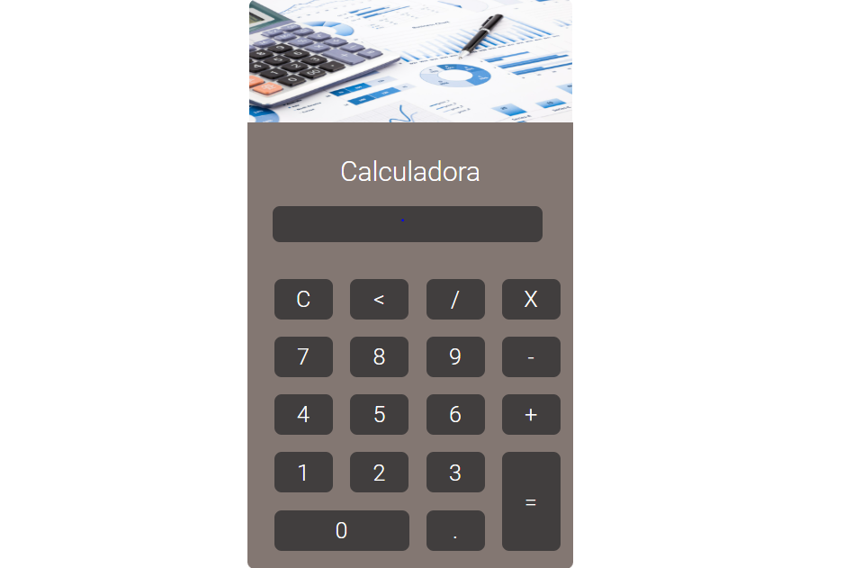

<h1 align="center"> Calculadora - Eletiva de Web </h1>

Lição realizada para a diciplina de programação para a internet.  

  <a href="#-tecnologias">Tecnologias</a>&nbsp;&nbsp;&nbsp;|&nbsp;&nbsp;&nbsp;
  <a href="#-projeto">Projeto</a>&nbsp;&nbsp;&nbsp;

 

  

## 🚀 Tecnologias

Esse projeto foi desenvolvido com as seguintes tecnologias:

- JavaScript
- HTML & CSS
- Git e Github

## 💻 Projeto

Objetivo do projeto foi fazer uma calculadora utilizando JS.

---

Feito com ♥ por Murilo Baron Pereira 👋
